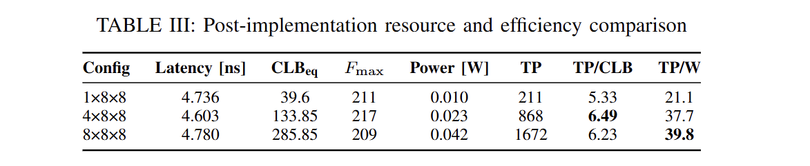
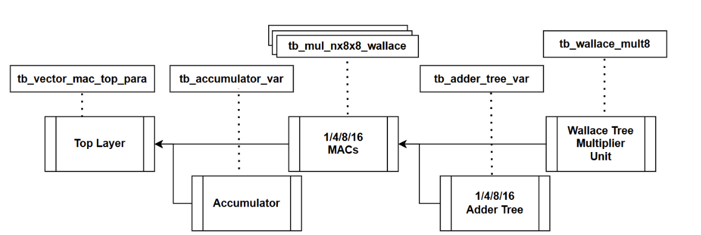
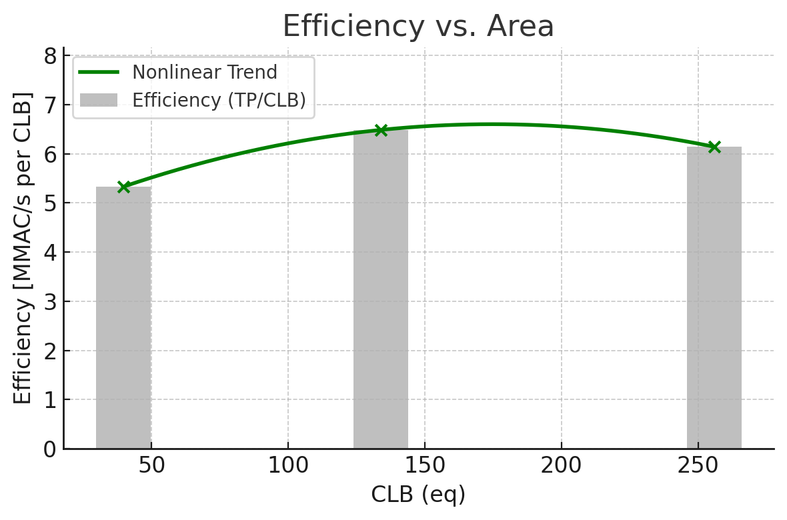
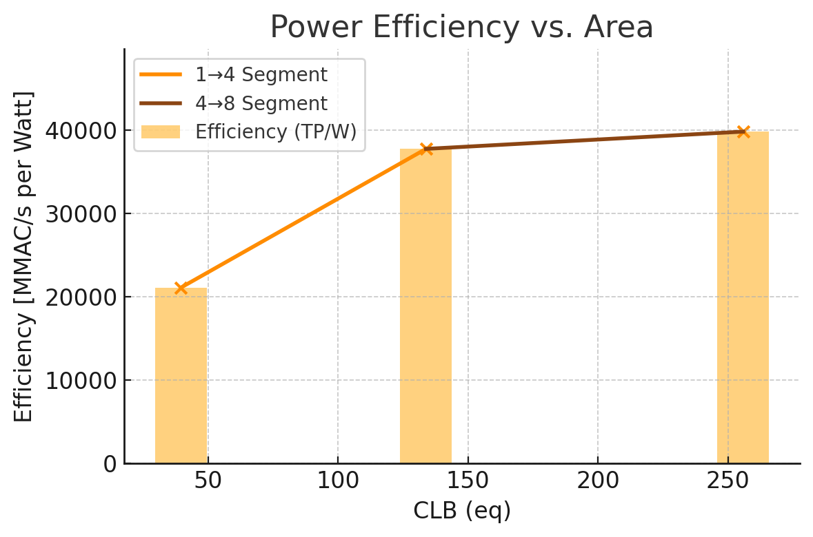

# INT8 Parallel Vector MAC – EEE232 Coursework 2

> **Device**  Artix-7 XC7A100T-1CSG324
> **Tool**    Vivado 2021.1
> **Peak**    1.67 GMAC/s @ 209 MHz (8-lane)
> **Best TP/CLB**  6.5 MMAC·s⁻¹·CLB⁻¹ (4-lane)

---

## 1 Design goal & major results

* **Objective** – a configurable INT8 sparse **vector × vector multiplier** capable of ≈ 1000 MACs, maximising throughput and minimising FPGA area.
* **Deliverables** – parameterised RTL, timing-clean 1/4/8/16-lane builds, self-checking test-benches, batch build scripts.
* **Post-implementation highlights**




---

## 2 Core building blocks

| File(s)                                     | Function                                                         | Notes           |
| ------------------------------------------- | ---------------------------------------------------------------- | --------------- |
| `wallace_tree_multiplier.v`, `fa.v`, `ha.v` | 8×8 Wallace multiplier, 3-stage, DSP-less                        | 82 LUT / 115 FF |
| `adder_tree_var.v`                          | Pipelined binary adder tree, depth & width scale with lane count | 2–4 cycles      |
| `accumulator_var.v`                         | Beat-programmable accumulator (⌈1000/lanes⌉)                     | 32-bit result   |

*(Insert multiplier\_unit diagram here if desired)*

---

## 3 Top-level architecture



* **Parallelism switch** – edit one line:

  ```verilog
  // RTL: src/vector_mac_top.v
  parameter ACTIVE_LANES = 4;  // 1 | 4 | 8 | 16

  // Simulation: sim/tb_vector_mac_top_para.v
  localparam LANE_P = 4;
  ```
* **Latency** = `3 + log2(N) + 1` cycles; **II = 1** for all modes.
* All test-benches confirm correctness and phase alignment.


---

## 4 Efficiency analysis

* **Throughput efficiency** (TP/CLB) and **Power efficiency** (TP/W) metrics.


<p align="center">
  
</p>

<p align="center">
  
</p>


---

## 5 Quick start

**Batch build & implementation**

```bash
git clone https://github.com/0xCapy/int8_vecmac.git
cd int8_vecmac
make vivado   # batch synth+impl+reports
make gui      # build then open Vivado GUI
```

**Simulation**

```bash
make sim      # runs tb_vector_mac_top_para (LANE_P=4)
```

---

## 6 Repository structure

```text
int8_vecmac/
├── src/              RTL sources
├── constr/           mul_clock.xdc
├── sim/              test-benches
├── doc/              figures and data diagrams
└── README.md         
```

---

## 7 License

MIT © 2025 Hubo Zhu
